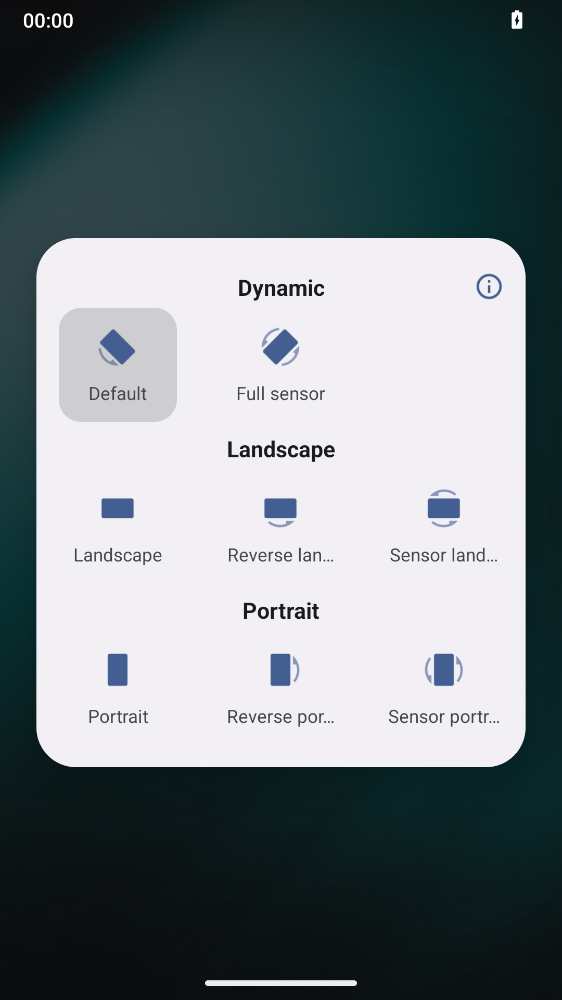

# Orientation Lock 2


<p align="center">
  
</p>

<p align="center">
  <b>An open source app to lock the screen orientation, for Android 5.0+</b>
</p>

<p align="center">
  <a href="README_zh.md">中文版</a>
</p>

---

## Introduction

This project is a continued maintenance version of [tuyafeng/OrientationLock](https://github.com/tuyafeng/OrientationLock). Since the original project has been inactive for a long time, in order to keep it compatible with newer Android versions and continue to provide a stable, lightweight orientation locking experience, we decided to update and maintain it based on the original work.

## Original Project Statement

This project is built upon the work of **Yafeng Tu**, [OrientationLock](https://github.com/tuyafeng/OrientationLock). The original project is licensed under the **GNU General Public License v3.0**.

> Original License Notice:
> 
> Copyright (C) 2024 Yafeng Tu
> 
> This program is free software: you can redistribute it and/or modify
> it under the terms of the GNU General Public License as published by
> the Free Software Foundation, either version 3 of the License, or
> (at your option) any later version.
> 
> This program is distributed in the hope that it will be useful,
> but WITHOUT ANY WARRANTY; without even the implied warranty of
> MERCHANTABILITY or FITNESS FOR A PARTICULAR PURPOSE. See the
> GNU General Public License for more details.

We respect and preserve all original copyright notices and license terms. This continued version is also open-sourced under the **GPL-3.0** license.

## What's New

Based on the original work, we have made the following updates:
- Setting interface
- Quickly restore the default direction
- Quick Settings tile for locking orientation
- The floating button sets the screen orientation
- Turn off battery optimization settings

## Preview

<p align="center">
  
</p>

## Download

- [GitHub Releases](https://github.com/XiaoHao560/OrientationLock/releases)
- Or build from source

## Build

```bash
git clone https://github.com/XiaoHao560/OrientationLock2.git
cd OrientationLock
./gradlew assembleRelease
```

## License

This project is licensed under the [GNU General Public License v3.0](LICENSE).

## Acknowledgements

- Thanks to [Yafeng Tu](https://github.com/tuyafeng) for the [OrientationLock](https://github.com/tuyafeng/OrientationLock) project